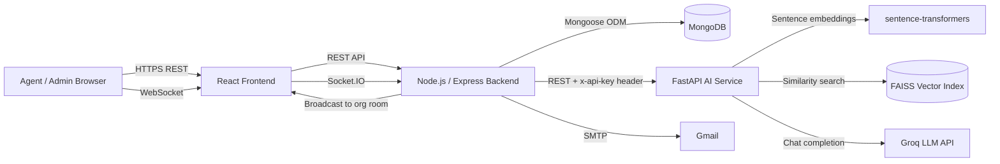
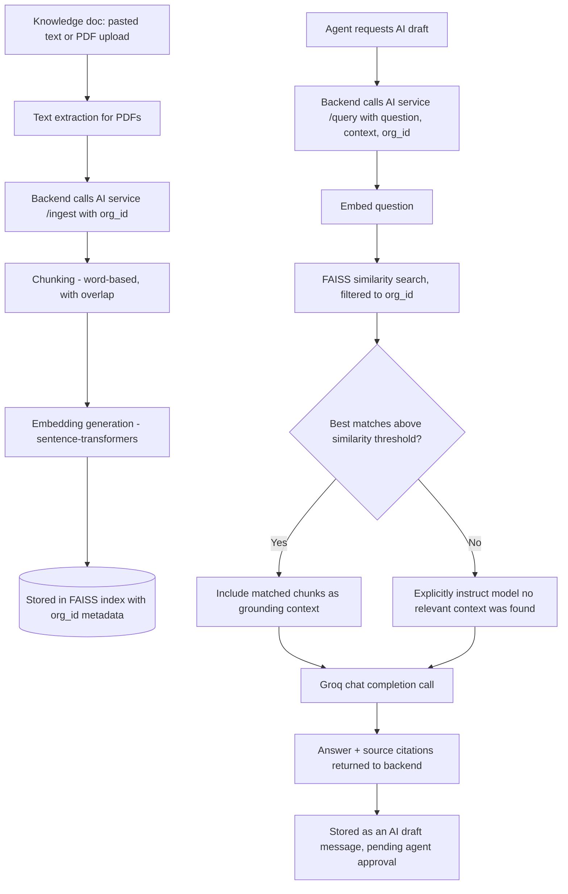
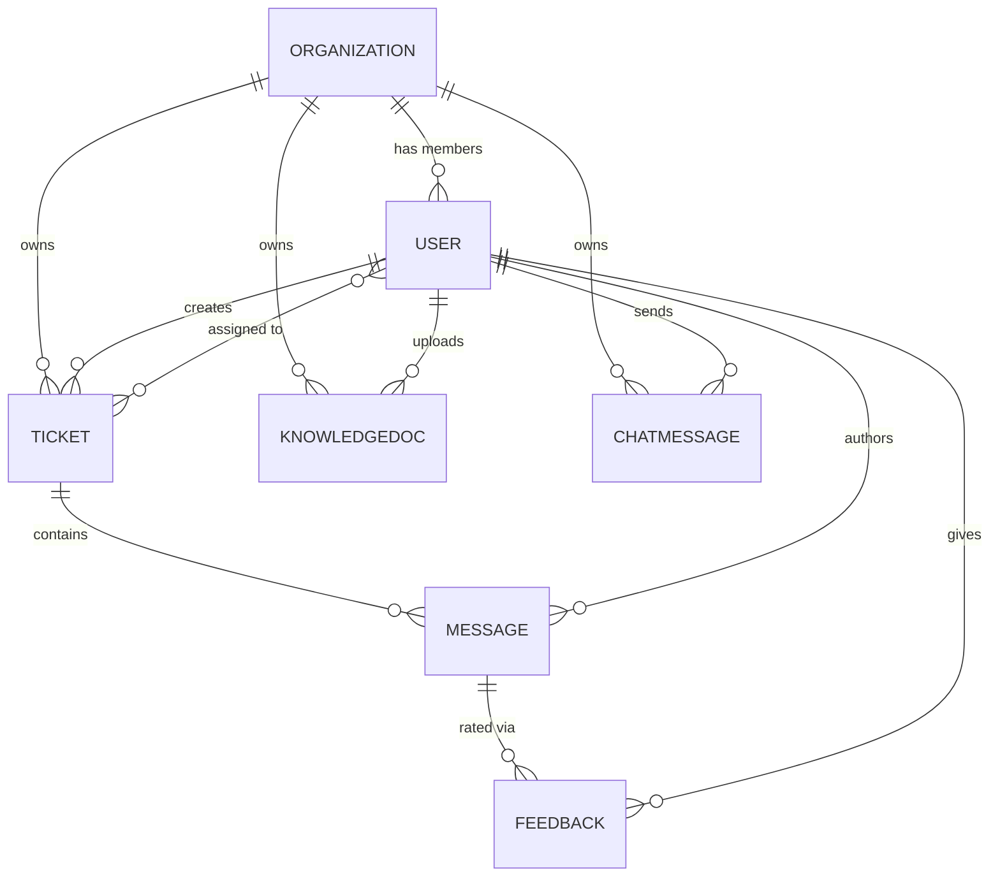
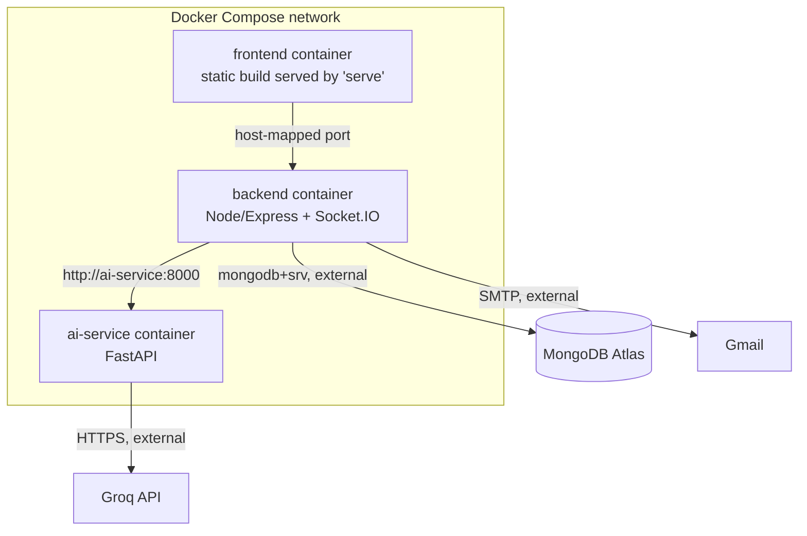

# AI SupportDesk — Intelligent Customer Support Platform

A multi-tenant customer support platform that combines ticket management with retrieval-augmented generation (RAG), enabling support teams to draft AI-assisted replies grounded in their own knowledge base rather than a general-purpose language model's untethered output.


---

## Overview

AI SupportDesk is a full-stack support desk application built around a core idea: AI-generated replies are only useful if they're grounded in facts a business actually controls. Rather than piping customer questions directly into a large language model, the system retrieves relevant passages from a company's own uploaded documentation (pasted text or PDFs) and only then asks the LLM to draft a reply using that retrieved context — a retrieval-augmented generation (RAG) pipeline rather than a raw chat wrapper.

The platform is multi-tenant: any number of independent organizations can use the same deployment, each with its own isolated tickets, team, knowledge base, and AI vector index. This distinguishes it from a basic single-tenant CRUD ticketing app — every layer of the system, including the vector similarity search inside the AI service, is scoped by organization ID, not just the database queries.

It is designed for small support teams — an admin who manages tickets and assigns agents, and agents who resolve tickets either manually or with AI-assisted drafts that are grounded, reviewed, and explicitly approved before being emailed to the customer.

---

## Key Features

- **Multi-tenant workspaces** — organizations are created with a unique invite code; agents join a specific organization using that code, and all data is isolated per organization.
- **Role-based access** — two roles, `admin` and `agent`. Admins create tickets and assign one or more agents to each ticket. Only the admin or an agent actually assigned to a ticket can reply, update its status, generate an AI draft, or approve one — unassigned agents have read-only visibility.
- **Ticket management** — creation, status (`open`/`pending`/`resolved`/`closed`), priority (`low`/`medium`/`high`/`urgent`), category, full-text search, and filtering.
- **Threaded ticket conversations** — messages tagged by sender type (`customer`, `agent`, `ai`), with AI-generated messages marked as drafts until an agent approves them.
- **RAG-powered AI drafts** — draft replies are generated from a knowledge base using semantic retrieval, with source citations shown alongside the answer, and an explicit "not found in knowledge base" fallback when no sufficiently relevant content exists.
- **Knowledge base management** — articles can be added as pasted text or uploaded as PDFs (parsed server-side and ingested through the same pipeline).
- **Agent approval workflow** — AI drafts are never sent automatically; an agent must approve a draft, at which point it is emailed to the customer.
- **Outbound email delivery** — approved agent replies and approved AI drafts are sent to the customer's email via SMTP.
- **Real-time updates** — new tickets, ticket updates, and new messages are pushed to all connected clients in the same organization over WebSockets, without polling or manual refresh.
- **Team chat** — a real-time internal chat channel scoped per organization, separate from ticket conversations.
- **Feedback capture** — agents can mark AI-generated replies as helpful or not helpful.
- **Dashboard analytics** — live counts and two breakdown charts (by status, by priority/urgency).
- **Responsive UI with dark mode** — a violet-themed interface built with Tailwind CSS, usable from mobile through desktop.


---

## System Architecture

The system is composed of three independently deployable services: a React frontend, a Node.js/Express backend that owns the database and real-time layer, and a Python/FastAPI service that owns the RAG pipeline. The backend never performs embedding or vector search itself — it delegates that entirely to the AI service over an internal, API-key-authenticated HTTP call.



---

## RAG / AI Workflow

Knowledge enters the system either as pasted text or as an uploaded PDF (text extracted server-side with `pdf-parse`). The backend forwards the title, content, and organization ID to the AI service's ingestion endpoint, which chunks the text, generates embeddings, and stores them in a FAISS index alongside metadata identifying which organization and source document each chunk belongs to.

When an agent asks a question or requests an AI draft, the backend forwards the question, recent conversation context, and organization ID to the AI service's query endpoint. The question is embedded and compared against the organization's chunks; results below a similarity threshold are discarded rather than passed to the LLM, so the model is not handed irrelevant context and asked to rationalize it. If no chunk clears the threshold, the prompt explicitly instructs the model to say so rather than invent an answer. Only when relevant chunks are found does the retrieved text become grounding context sent to the LLM.



This differs from sending a question directly to an LLM in that the model's output is constrained to what the retrieval step actually found — the citations returned alongside the answer point back to the specific knowledge base entries used, and an empty retrieval result is surfaced honestly instead of being papered over by the model's own general knowledge.

---

## Technology Stack

| Layer | Technology | Purpose |
|---|---|---|
| Frontend | React 18, TypeScript, Vite | Single-page application |
| Frontend styling | Tailwind CSS | Utility-first styling, dark mode, responsive layout |
| Frontend data viz | Recharts | Dashboard pie charts |
| Frontend real-time | socket.io-client | Live ticket, message, and chat updates |
| Backend | Node.js, Express | REST API |
| Backend real-time | Socket.IO | WebSocket layer, JWT-authenticated over the handshake |
| Backend auth | jsonwebtoken, bcryptjs | Token issuance/verification, password hashing |
| Backend uploads | Multer, pdf-parse | In-memory PDF upload and text extraction |
| Backend email | Nodemailer | SMTP delivery of agent/AI replies to customers |
| Backend logging | Winston, Morgan | Structured logging and HTTP request logging |
| Database | MongoDB, Mongoose | Application data, ODM/schema layer |
| AI service | Python, FastAPI, Uvicorn | RAG pipeline HTTP service |
| Embeddings | sentence-transformers (`all-MiniLM-L6-v2`) | Local, free text embedding generation |
| Vector search | FAISS (`faiss-cpu`) | Similarity search over embedded chunks |
| LLM integration | httpx, Groq API (OpenAI-compatible) | Chat completion for drafting replies |
| Containerization | Docker, Docker Compose | Independent, reproducible service builds |

---

## Project Structure

```text
ai-support-desk/
├── backend/
│   ├── src/
│   │   ├── config/          # DB connection, logger
│   │   ├── models/          # Mongoose schemas
│   │   ├── controllers/     # Route handlers
│   │   ├── routes/          # Express routers
│   │   ├── middleware/      # JWT auth, error handling
│   │   ├── utils/           # AI service client, email client, permissions, token generation
│   │   ├── socket.js        # Socket.IO server and auth
│   │   └── server.js        # HTTP + Socket.IO entrypoint
│   └── Dockerfile
├── ai-service/
│   ├── app/
│   │   ├── routes/          # ingest, query, health endpoints
│   │   ├── config.py        # Settings (embedding model, thresholds, LLM config)
│   │   ├── embeddings.py    # sentence-transformers wrapper
│   │   ├── vector_store.py  # FAISS index management, org-scoped filtering
│   │   ├── rag.py           # Chunking, retrieval, prompt construction, LLM call
│   │   └── main.py          # FastAPI app, API-key middleware
│   └── Dockerfile
├── frontend/
│   ├── src/
│   │   ├── api/              # Axios clients per resource
│   │   ├── components/       # Reusable UI components
│   │   ├── context/          # Auth and theme providers
│   │   ├── pages/             # Route-level views
│   │   ├── socket.ts          # Socket.IO client connection
│   │   └── types/             # Shared TypeScript interfaces
│   └── Dockerfile
├── docker-compose.yml
└── README.md
```

---

## Engineering Problems Solved

**Cross-service communication between Node and Python.** The backend and the AI service are separate runtimes with no shared memory or process. Requests between them are authenticated with a shared internal API key (`x-api-key` header) so the AI service cannot be called by anything other than the backend, even though both are reachable on the Docker network.

**Multi-tenant isolation inside a vector index.** FAISS has no native concept of tenancy or filtering by attribute at search time. This was solved by over-fetching a larger candidate set from the index than the final desired result count, then filtering candidates by an `org_id` stored in each chunk's metadata before truncating to the requested top-k — avoiding the need to run a separate FAISS index per organization while still guaranteeing one organization's knowledge base can never leak into another's AI answers.

**Honest handling of retrieval misses.** An early version of the RAG prompt always injected whatever chunks FAISS returned, even when none were truly relevant, relying on the LLM to notice and hedge. This was replaced with an explicit similarity-score threshold: chunks below the threshold are discarded before the prompt is built, and the system prompt itself changes depending on whether any chunk survived, so the model is told outright when there is nothing relevant to work with rather than being handed weak matches implicitly.

**Docker DNS resolution against MongoDB Atlas.** `mongodb+srv://` connection strings require a DNS SRV lookup. Under Docker Desktop, the container's default DNS resolver intermittently failed this lookup (`querySrv ECONNREFUSED`) even though the same connection string worked outside a container. This was resolved by explicitly pointing the backend container's DNS servers at `8.8.8.8` / `8.8.4.4` in `docker-compose.yml`.

**Build-time vs. runtime environment variables in a containerized SPA.** The backend and AI service read environment variables at runtime via Compose's `env_file`, so excluding `.env` from their Docker build context is correct practice. The frontend, however, is a static Vite build — `VITE_API_URL` is compiled directly into the JavaScript bundle at `npm run build` time, with no runtime environment step afterward. Excluding `.env` from the frontend's `.dockerignore` silently produced a build with an undefined API base URL, causing all API calls to resolve to relative paths instead of the backend's address. The fix was recognizing that these two categories of service need opposite `.dockerignore` treatment for the same file.

**Enforcing ticket-level authorization on both ends.** Role and assignment checks were initially only applied in the message-sending and AI-draft endpoints, leaving the general ticket-update endpoint (used for status changes) reachable by any authenticated agent in the organization regardless of assignment. This was corrected by extracting a shared `canReply(ticket, user)` permission check into `backend/src/utils/permissions.js` and applying it to every mutating ticket and message endpoint, not just the ones where the gap was first noticed — and gating the corresponding UI controls on the same condition client-side, without relying on the UI as the actual security boundary.

**Real-time state without a separate message broker.** Rather than introducing a dedicated pub/sub system, Socket.IO rooms are keyed by organization ID (`org:<organizationId>`), and the same JWT used for REST requests is verified during the WebSocket handshake. Mutating REST endpoints emit events into their organization's room after a successful database write, giving every connected client in that organization live updates without polling.

---

## Authentication & Authorization

Authentication is JWT-based. On login or registration, the backend issues a signed token containing the user's ID; the frontend stores it and attaches it as a `Bearer` token on every REST request and during the Socket.IO handshake.

Two roles exist:
- **admin** — the user who creates an organization. Can create tickets, assign one or more agents to a ticket, and reply/update/generate AI drafts on any ticket in the organization.
- **agent** — joins an existing organization via its invite code. Can view every ticket in the organization, but can only reply, change status, or generate/approve AI drafts on tickets they are explicitly assigned to. On unassigned tickets, agents have read-only access.

Every protected REST endpoint runs through a `protect` middleware that verifies the JWT and loads the current user; ticket- and admin-only actions run through an additional `adminOnly` middleware or an explicit `canReply` permission check against the specific ticket being acted on.

---

## Data / Database Design



- **Organization** — name and a unique invite code used by agents to join.
- **User** — name, email, hashed password, role (`admin`/`agent`), and a reference to its organization.
- **Ticket** — subject, description, customer name/email, status, priority, category, `createdBy` (a User), `assignedAgents` (an array of Users), and its organization.
- **Message** — belongs to a ticket; `sender` is `customer`, `agent`, or `ai`; `author` references the acting User (null for customer messages); AI messages carry an `isDraft` flag and an array of source citations.
- **KnowledgeDoc** — title, content, source type (`manual` or `upload`), uploader, indexing status, and chunk count.
- **Feedback** — links a rating (`helpful`/`not_helpful`) to a specific Message and Ticket, recorded against the rating user.
- **ChatMessage** — organization-scoped internal chat message with an author.

---

## API Architecture

```text
Authentication      /api/auth
Tickets              /api/tickets
Ticket Messages       /api/messages
Knowledge Base        /api/knowledge
Feedback              /api/feedback
Team Chat              /api/chat
```

**Authentication**
- `POST /api/auth/register-organization` — create a new organization and its admin user
- `POST /api/auth/register-agent` — join an existing organization by invite code
- `POST /api/auth/login`
- `GET /api/auth/me`
- `GET /api/auth/agents` — list agents in the caller's organization

**Tickets**
- `GET /api/tickets` — list, with optional status/priority/search/assignedTo query filters
- `POST /api/tickets` — admin only
- `GET /api/tickets/:id`
- `PUT /api/tickets/:id` — admin, or an agent assigned to that ticket
- `DELETE /api/tickets/:id`
- `PUT /api/tickets/:id/assign` — admin only, sets the assigned agent list
- `GET /api/tickets/stats/dashboard`

**Ticket Messages**
- `GET /api/messages/:ticketId`
- `POST /api/messages/:ticketId` — admin, or an agent assigned to that ticket
- `POST /api/messages/:ticketId/ai-draft` — generates a RAG-grounded draft
- `PUT /api/messages/draft/:id/approve` — approves a draft and triggers customer email

**Knowledge Base**
- `GET /api/knowledge`
- `POST /api/knowledge` — add via pasted text
- `POST /api/knowledge/upload` — add via PDF upload
- `DELETE /api/knowledge/:id`

**Feedback**
- `POST /api/feedback`
- `GET /api/feedback/stats`

**Team Chat**
- `GET /api/chat` — message history (live messages arrive over Socket.IO)

---

## Local Installation & Setup

### Prerequisites

Git, Node.js, Python, and Docker Desktop.

### Clone

```bash
git clone <repository-url>
cd ai-support-desk
```

### Environment Variables

`.env` files are intentionally excluded from version control. Create the following three files manually before running the project.

**`backend/.env`**
```env
PORT=5000
NODE_ENV=development
MONGO_URI=your_mongodb_connection_string
JWT_SECRET=your_jwt_signing_secret
JWT_EXPIRES_IN=7d
CLIENT_URL=http://localhost:4173
AI_SERVICE_URL=http://localhost:8000
AI_SERVICE_API_KEY=a_shared_secret_matching_ai_service_env
EMAIL_USER=your_gmail_address
EMAIL_PASS=your_gmail_app_password
EMAIL_FROM_NAME=Support Team
```

**`ai-service/.env`**
```env
PORT=8000
API_KEY=a_shared_secret_matching_backend_env
EMBEDDING_MODEL_NAME=all-MiniLM-L6-v2
VECTOR_STORE_PATH=./data/vector_store
LLM_API_BASE_URL=https://api.groq.com/openai/v1
LLM_API_KEY=your_llm_provider_api_key
LLM_MODEL=your_chosen_model_id
CHUNK_SIZE=800
CHUNK_OVERLAP=100
TOP_K=4
```

**`frontend/.env`**
```env
VITE_API_URL=http://localhost:5000/api
```

`AI_SERVICE_API_KEY` (backend) and `API_KEY` (AI service) must be identical — this is the shared secret that authenticates backend-to-AI-service calls. `MONGO_URI` requires a MongoDB instance (Atlas or self-hosted). `LLM_API_KEY` requires an OpenAI-compatible provider key.

### Running with Docker

```bash
docker compose up --build
```

This builds and starts the frontend, backend, and AI service as three containers on a shared Docker network. The frontend is served as a static production build; the backend reaches the AI service internally via its Compose service name (`http://ai-service:8000`) rather than `localhost`.

### Running without Docker

Each service can be run independently:

```bash
# Backend
cd backend
npm install
npm run dev

# AI service
cd ai-service
python -m venv venv
source venv/bin/activate   # or venv\Scripts\activate on Windows
pip install -r requirements.txt
uvicorn app.main:app --reload --port 8000

# Frontend
cd frontend
npm install
npm run dev
```

---

## Docker Architecture



Each service has its own `Dockerfile` and is built as an independent image. The backend and AI service communicate over Docker's internal DNS using their Compose service names; only the frontend is exposed for direct browser access in a typical deployment, with the backend's port also mapped out to the host for local development and API testing.

---

## Example Workflow

1. An admin registers and creates a new organization, receiving an invite code.
2. The admin shares the invite code with teammates, who register as agents under the same organization.
3. The admin creates a ticket on behalf of a customer and assigns one or more agents to it.
4. An assigned agent opens the ticket and reviews the customer's message.
5. The agent clicks "Generate AI draft reply," which triggers a RAG query against the organization's knowledge base.
6. The AI service returns a drafted answer along with the specific knowledge base sources it used.
7. The agent reviews the draft, edits if needed, and approves it.
8. On approval, the reply is emailed to the customer, and the message is marked as no longer a draft.
9. The agent or admin can rate the AI's draft as helpful or not helpful, and can watch ticket status update live for any other user viewing the same ticket.

---

## Example Knowledge Base / RAG Usage

A company could populate the knowledge base with:
- Product manuals or setup guides, pasted as text
- Internal troubleshooting runbooks
- FAQ documents, uploaded directly as PDFs

Once ingested, agents can ask ticket-specific questions and receive a drafted reply that cites which knowledge base entries it drew from, rather than an unsourced answer. If a customer's question falls outside what has been uploaded (for example, asking about a product category with no corresponding documentation), the system is designed to say it found no relevant information rather than fabricate a plausible-sounding but unverified answer.

---

## Configuration & Security Notes

- `.env` files are excluded from version control in every service (`backend/`, `ai-service/`, `frontend/`) and must be created locally.
- The AI service rejects any request without a matching `x-api-key` header, preventing it from being called by anything other than the backend.
- Passwords are hashed with bcrypt before storage; plaintext passwords are never persisted.
- CORS on the backend is restricted to a single configured `CLIENT_URL` origin rather than left open.
- Ticket- and message-level authorization checks are enforced server-side (not only hidden in the UI), so a client cannot bypass role or assignment restrictions by calling the API directly.
- Gmail SMTP is used for outbound email in this configuration; it is rate-limited by Google and is not intended as a high-volume transactional email solution.

---

## Known Limitations

- The AI service's vector store is a single FAISS index filtered by organization ID at query time rather than one index per tenant; this is adequate at the current scale but is not how a large-scale multi-tenant vector search deployment would typically be structured.
- There is no automated test suite currently in the repository.
- The LLM integration depends on an external, third-party API (Groq or another OpenAI-compatible provider); the system's AI functionality is unavailable if that provider is unreachable or misconfigured, though the rest of the application continues to function.
- Outbound email uses personal Gmail SMTP rather than a dedicated transactional email provider, which affects deliverability at scale.
- The current deployment model assumes manual environment configuration and container orchestration via Docker Compose; there is no CI/CD pipeline or managed cloud deployment configuration included.

---

## Future Improvements

- Automated testing (unit and integration) across backend, AI service, and frontend
- CI/CD pipeline for build, test, and deployment
- A dedicated, horizontally scalable vector database in place of a single-process FAISS index
- Streaming AI responses instead of a single blocking completion call
- A transactional email provider in place of Gmail SMTP for production-scale delivery
- More granular, per-permission role definitions beyond the current admin/agent split
- Structured observability (metrics, tracing) beyond the current Winston/Morgan logging
- A notification system for ticket assignment and status changes

---

## Learning / Engineering Takeaways

This project involved designing and integrating three services with different runtimes and responsibilities into a single coherent system: a stateful real-time backend, a stateless AI/retrieval microservice, and a frontend consuming both a REST API and a WebSocket stream. It required reasoning about authorization at multiple layers (route-level, resource-level, and within a third-party vector index with no native tenancy support), diagnosing environment- and container-specific failure modes that don't reproduce outside Docker, and iteratively correcting authorization gaps discovered through actual usage rather than only at initial design time.

---

## Author

**Ayush Srivastava**

GitHub:  https://github.com/Ayush-0607-eng
